<p align="center">
  
</p>

<h1 align="center">PulseDeck</h1>

<p align="center">
  A native macOS system monitor that combines the information density of the Windows&nbsp;11
  Task Manager <em>Performance</em> view with macOS&nbsp;26 design and Liquid Glass.
</p>

<p align="center">
  <a href="https://github.com/MagicalWig34653/PulseDeck/actions/workflows/ci.yml"></a>
  <a href="https://github.com/MagicalWig34653/PulseDeck/releases/latest"></a>
  
  
</p>

---

> [!IMPORTANT]
> **Pre-release (0.x).** All planned milestones are implemented: CPU, memory, disks, network
> (including Wi‑Fi and Tailscale), GPU, energy, USB, processes and Docker containers, with
> 60-second charts and hover inspection. Values macOS does not provide reliably show
> **Not Available**. PulseDeck never displays invented or placeholder values.

## Screenshots

<p align="center">
  <picture>
    <source media="(prefers-color-scheme: dark)" srcset="docs/images/performance-dark.png">
    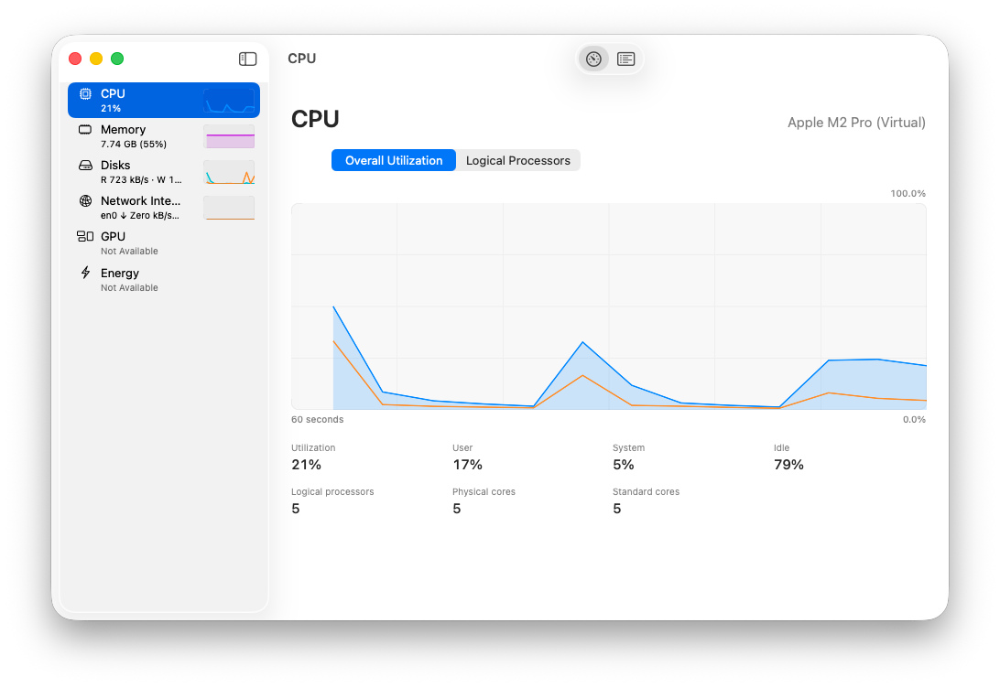
  </picture>
</p>

| Memory | Network interfaces |
|---|---|
| 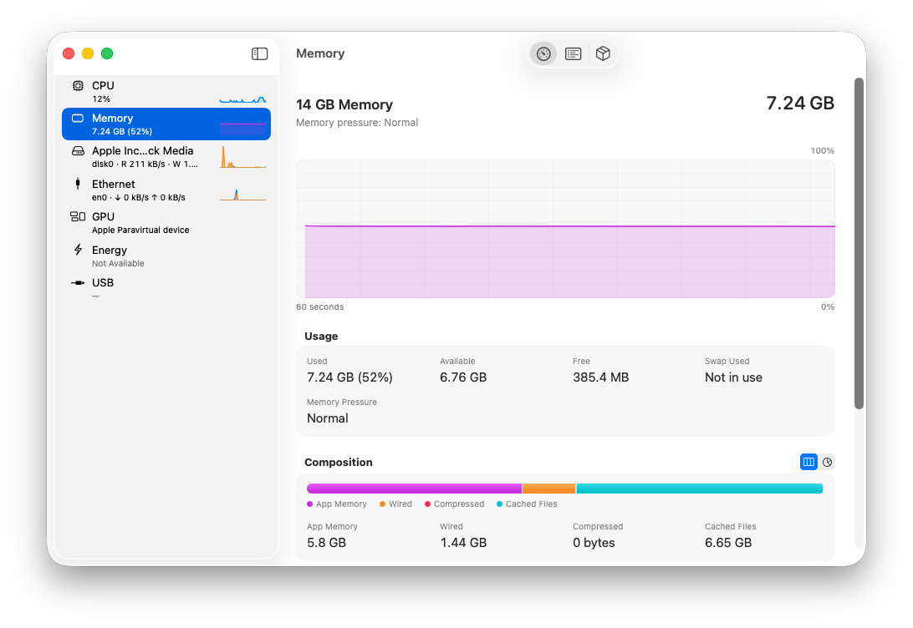 | 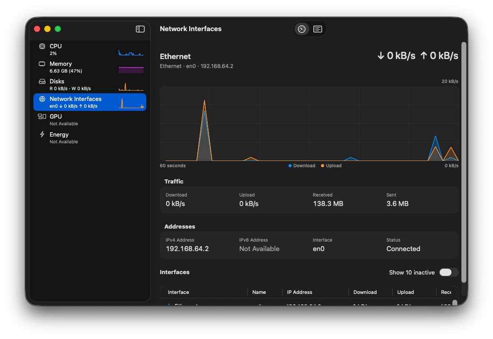 |

| Disks | Logical processors |
|---|---|
| 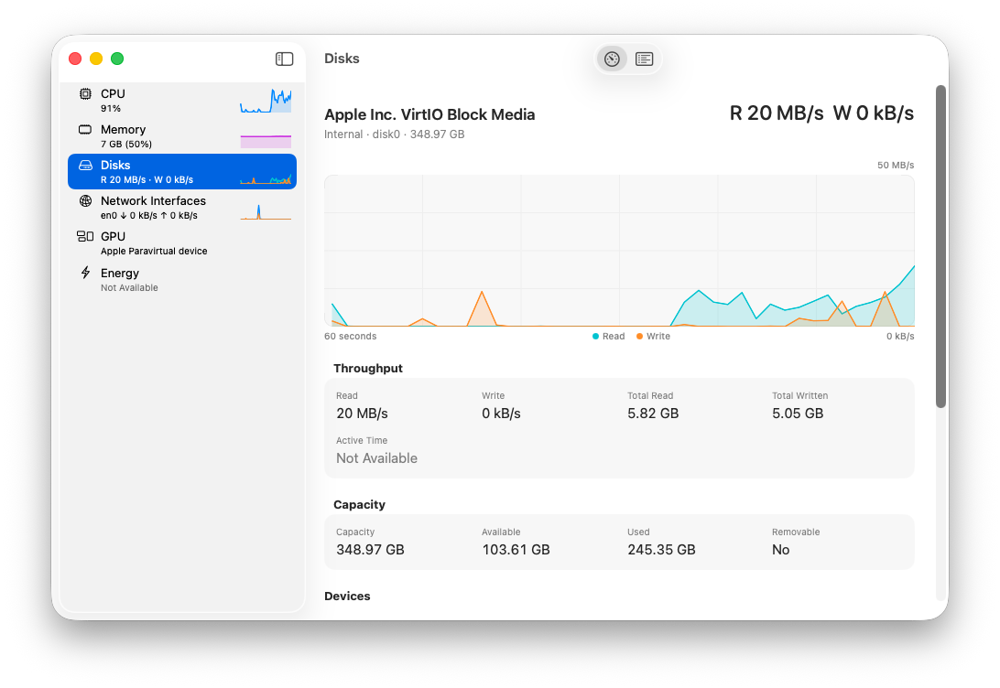 | 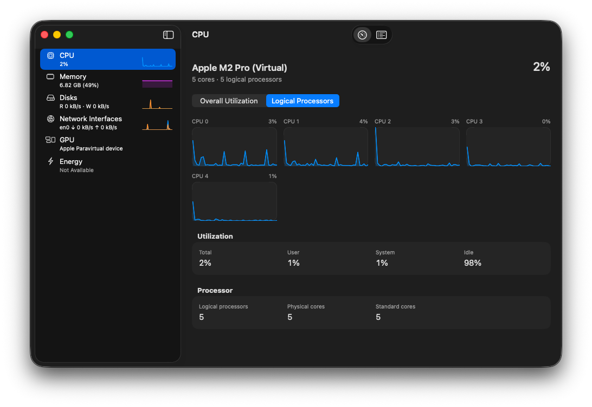 |

| GPU | Energy |
|---|---|
| 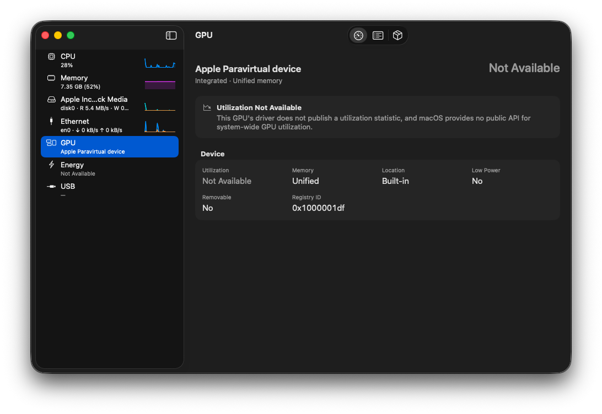 | 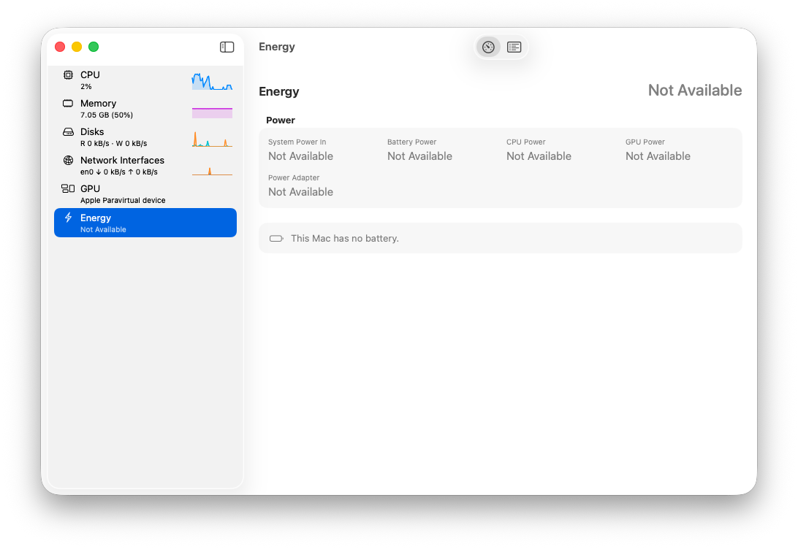 |

| Processes | Processes (sidebar) |
|---|---|
| 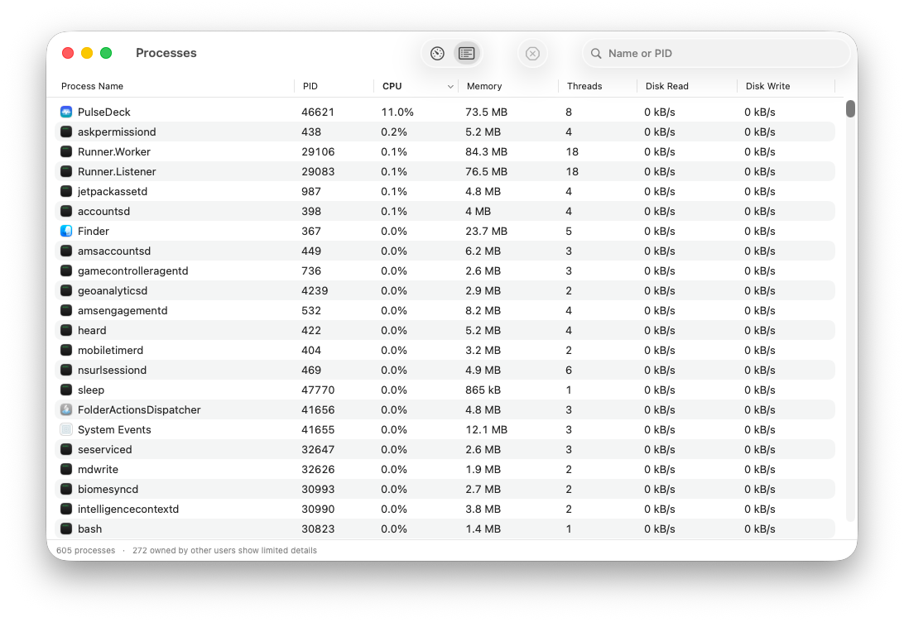 | 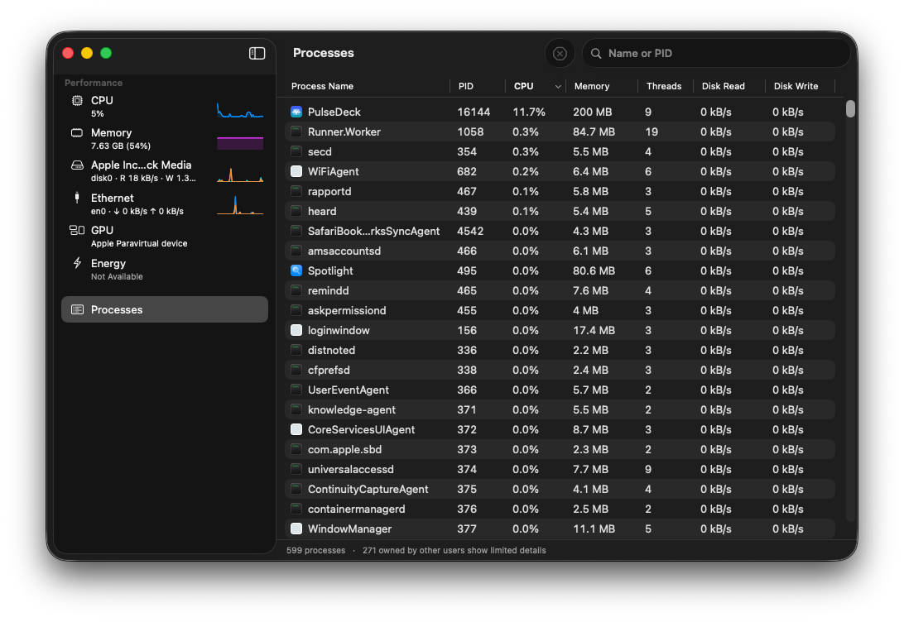 |

| Memory by process and compression | Disk details: bus, mount points, snapshots |
|---|---|
| 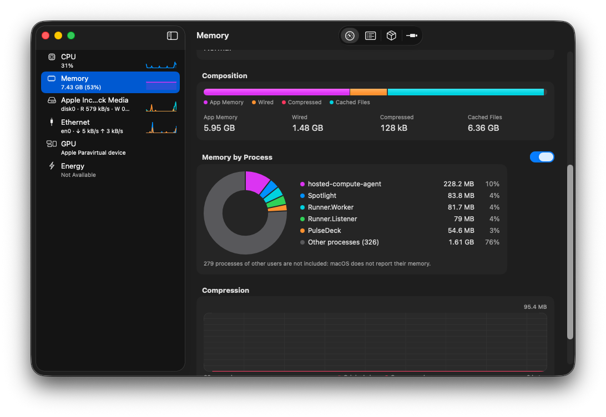 | 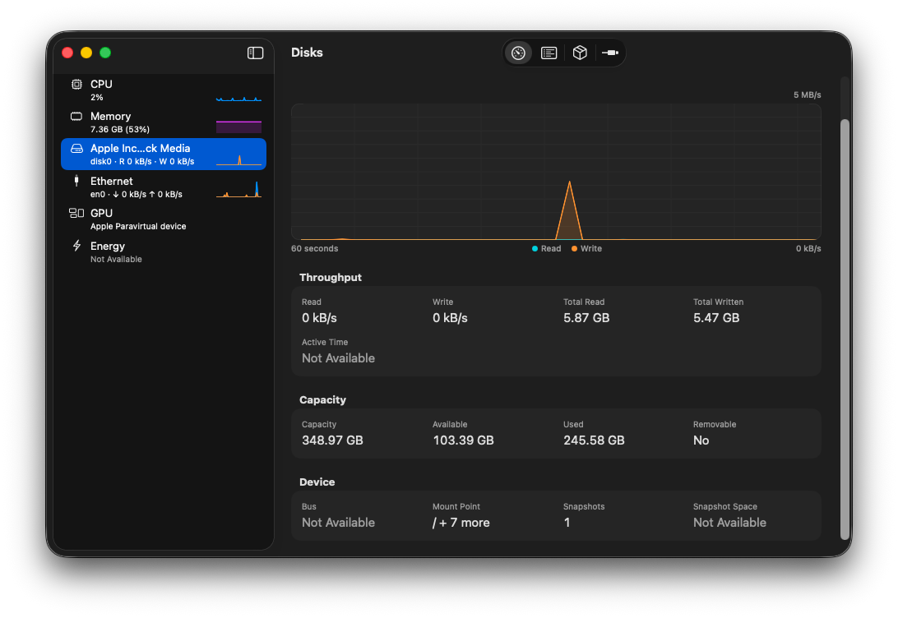 |

| USB tree | Containers |
|---|---|
| 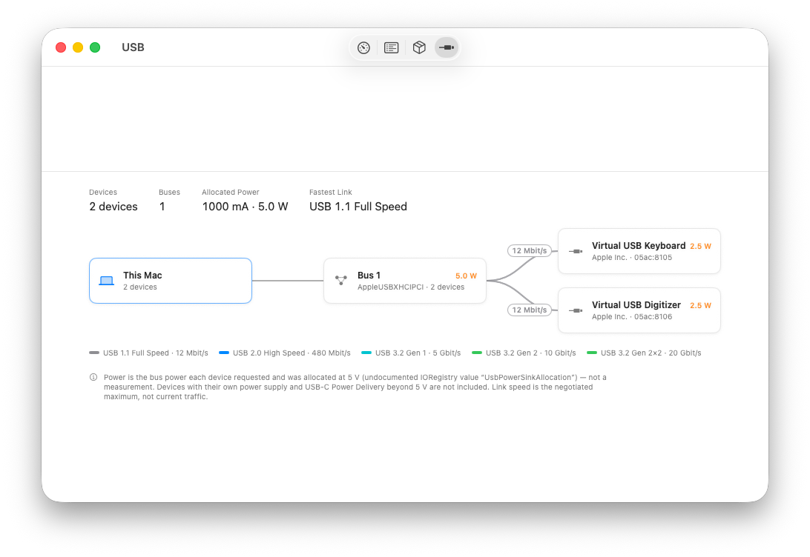 | 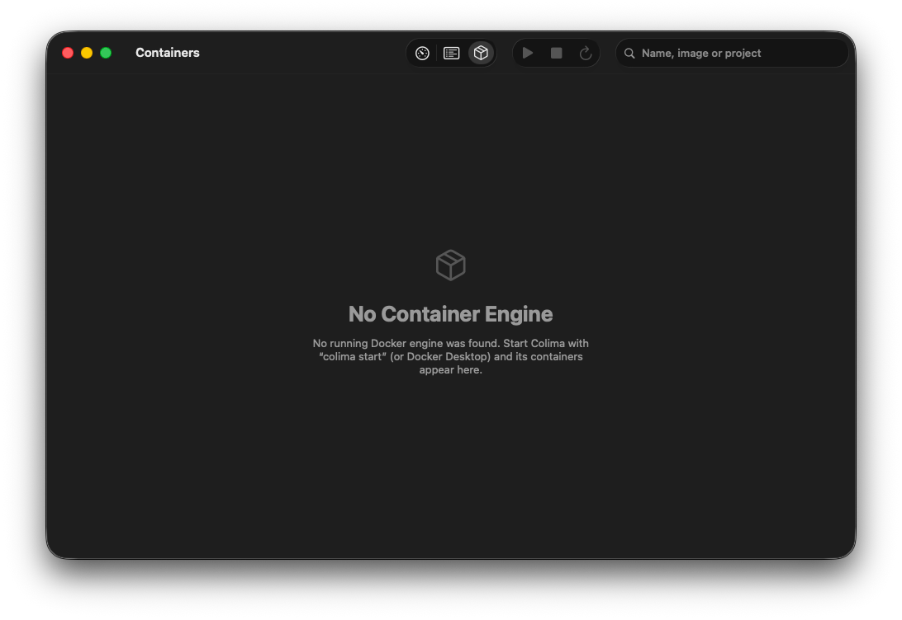 |

| Top bar navigation | Sidebar navigation |
|---|---|
| 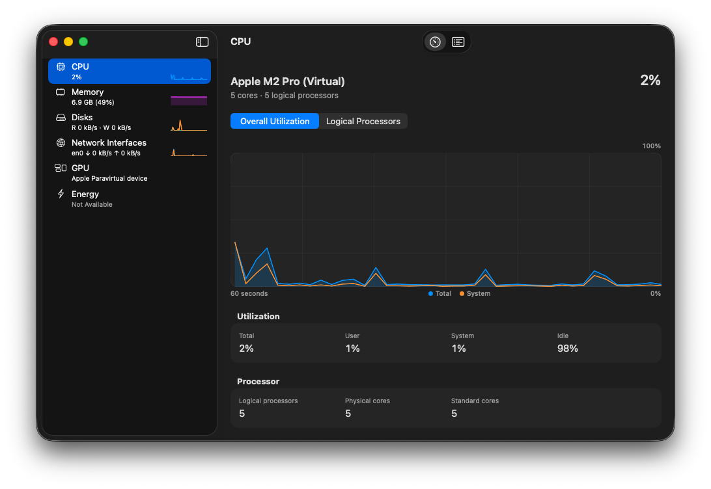 | 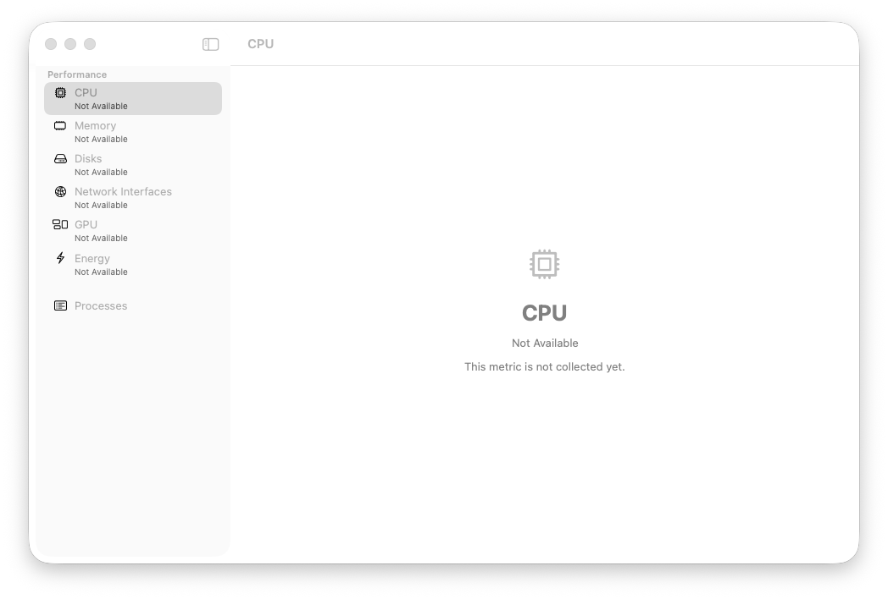 |

Screenshots are captured automatically from the real app with live data on a macOS 26 runner
(a virtual machine, hence "Apple M2 Pro (Virtual)" and the VirtIO disk) by the
[Screenshots workflow](.github/workflows/screenshots.yml). The runner has no Wi‑Fi, Tailscale,
Docker engine or CPU frequency sensors and only two virtual USB devices, so those parts show what
they show there — for example the Containers section's "No Container Engine" state — rather than
mock data.

## Features

Implemented:

- **CPU** — total, user, system and idle utilization; performance vs. efficiency cores chart;
  per-logical-processor charts with P/E cores coloured apart; cluster frequencies (from the private
  IOReport library, labelled); uptime; model name and core counts.
- **Memory** — used (App Memory + Wired + Compressed), available, wired, compressed, cached files,
  free, swap and memory pressure, with a composition bar, a compression chart (compressed vs.
  original size, ratio) and an optional pie chart of the processes using the most memory (five
  largest, grouped by name, plus the rest).
- **Network** — every interface individually (Ethernet, Wi‑Fi, Thunderbolt, bridges, VPN/tunnels),
  download/upload rates from 64-bit kernel counters, totals, local IPv4/IPv6 addresses, negotiated
  link speed, Wi‑Fi standard/rate/channel/signal, and hot-plug/VPN reconnect handling.
- **Tailscale** — the Tailscale interface is detected; its page shows the tailnet, a flow diagram of
  current connections (direct or via DERP relay) and a peer table with bandwidth, read from the
  Tailscale client's local API.
- **Disks** — every storage device with read/write throughput, cumulative transfer, capacity,
  available space (APFS containers counted once), bus, mount points and APFS snapshot count.
- **USB** — its own section with a tree diagram: this Mac → buses → hubs → devices, connectors
  coloured and labelled by negotiated link speed, and the bus power allocated to each device (an
  allocation reported by macOS, not a measurement — labelled).
- **Containers** — local Docker containers (Colima, Docker Desktop or any local Docker socket) with
  CPU, memory, network and ports; Start, Stop and Restart.
- **GPU** — every Metal device (name, integrated/discrete, unified memory, location) and
  system-wide utilization with a history chart. Utilization comes from an undocumented driver
  statistic (`IOAccelerator` “Device Utilization %”); the page says so, and shows *Not Available*
  where a driver does not publish it.
- **Energy** — battery charge, state, time remaining, voltage and current; battery charge/discharge
  power (*derived* from voltage × current); on MacBooks, the power drawn from the adapter
  (*System Power In*, an undocumented battery-controller value, labelled as such). Battery power is
  never presented as system power. CPU/GPU power: *Not Available* (no public API).
- **Processes** — native table with name, PID, CPU, memory (physical footprint), threads and disk
  read/write rates; sorting, search, multi-selection, keyboard navigation, a context menu, Quit /
  Force Quit with confirmation and Show in Finder. PIDs are tracked together with their start time,
  so a reused PID never inherits another process's numbers or receives a signal meant for it.
  Other users' processes (e.g. root) show name and PID; macOS withholds their details.
- **One sidebar entry per device** — like Task Manager, every disk and network interface has its
  own entry with live value and sparkline. Any of them can be hidden (context menu or Settings →
  Sidebar); loopback, never-used interfaces and disk images start hidden.
- **60-second history charts** with hover inspection: a vertical rule, highlighted points, the
  sample's time and all series values. Hovering only reads recorded history. A fine grid scrolls
  with the data and charts scroll smoothly while the window is in front (both optional).
- **Hold Control to pause** the window's updates; sampling continues and nothing is lost.
- **Menu bar app** — keeps running in the menu bar when the window closes; the Dock icon appears
  only while the main window is open. The menu bar panel shows CPU, memory, GPU, energy and network
  with live values and 60-second sparklines; each row opens its page. Optional live metric in the
  menu bar: CPU, memory, GPU, network download/upload of the primary interface, battery power or
  battery charge.
- **Launch at login** through macOS's login items (Settings → General).
- **Accessibility** — VoiceOver labels throughout, Audio Graphs for every chart, stronger chart lines
  with Increase Contrast, no animations, full keyboard navigation in lists and tables.
- **Two navigation styles** — Liquid Glass top bar (default) or sidebar, persisted in Settings.
- **Energy-aware sampling** — every second (configurable 0.5–5 s) while the window or menu bar
  panel is visible; every 3 s
  (configurable 2–5 s) when they are closed,
  minimised or fully covered; stopped during sleep, with all counter baselines discarded on wake so
  no bogus spikes appear.

PulseDeck's own resource use is measured by a profiling workflow: about 0.3 % of one core and a
14 MB memory footprint with no growth while running in the menu bar (details and method:
[`docs/PERFORMANCE.md`](docs/PERFORMANCE.md)).

Some requested metrics have no reliable public macOS API (for example CPU/GPU package power,
per-process network traffic and disk active time). These are shown as *Not Available*; see
[`TECHNICAL_LIMITATIONS.md`](TECHNICAL_LIMITATIONS.md).

## Installation

1. Download `PulseDeck-<version>.dmg` from the
   [latest release](https://github.com/MagicalWig34653/PulseDeck/releases/latest).
2. Open the disk image and drag **PulseDeck** into **Applications**.

<p align="center">
  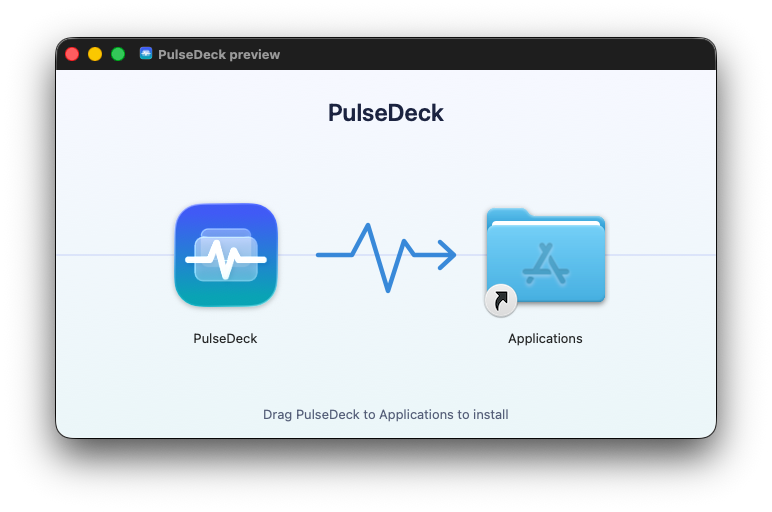
</p>

> [!NOTE]
> Release builds are currently **ad-hoc signed and not notarized** (no Developer ID yet). On first
> launch macOS will refuse to open the app. Open **System Settings → Privacy & Security** and click
> **Open Anyway**, or remove the quarantine attribute:
>
> ```sh
> xattr -dr com.apple.quarantine /Applications/PulseDeck.app
> ```

Each release also includes a `.sha256` checksum file.

## Requirements

- macOS 26 or later (Apple Silicon primary; release builds are universal)
- To build: Xcode 26 or later

## Building from source

```sh
git clone https://github.com/MagicalWig34653/PulseDeck.git
cd PulseDeck
open PulseDeck.xcodeproj          # then Run the "PulseDeck" scheme
```

Command line:

```sh
# Core package tests (models, engine, ring buffer, counter math, formatting)
swift test --package-path PulseDeckKit

# App build + tests through the Xcode scheme
xcodebuild -project PulseDeck.xcodeproj -scheme PulseDeck -destination 'platform=macOS' test
```

Without a Mac (e.g. a Linux container), `scripts/setup-linux-swift.sh` installs a Swift toolchain
for building and testing the platform-independent core; see [`CLAUDE.md`](CLAUDE.md).

Build a disk image locally:

```sh
xcodebuild -project PulseDeck.xcodeproj -scheme PulseDeck -configuration Release \
  -derivedDataPath build/DerivedData CODE_SIGN_STYLE=Manual CODE_SIGN_IDENTITY=- build
scripts/build-dmg.sh build/DerivedData/Build/Products/Release/PulseDeck.app 0.1.0 build/PulseDeck-0.1.0.dmg
```

## Project layout

| Path | Contents |
|---|---|
| `PulseDeck/` | SwiftUI app: lifecycle, main window, menu bar, settings, `AppIcon.icon` (Icon Composer) |
| `PulseDeckKit/` | UI-free Swift package: snapshot models, `MonitoringEngine`, `SamplingPolicy`, `RingBuffer`, counter math, tests |
| `packaging/dmg/` | DMG layout (`dmgbuild` settings) and the AppKit background renderer |
| `scripts/` | DMG build script and window capture helper |
| `.github/workflows/` | CI, release (DMG), screenshots |

Documentation:

- [`SPEC.md`](SPEC.md) — product and engineering specification (authoritative)
- [`IMPLEMENTATION_PLAN.md`](IMPLEMENTATION_PLAN.md) — architecture, telemetry matrix, milestones
- [`TECHNICAL_LIMITATIONS.md`](TECHNICAL_LIMITATIONS.md) — metrics without reliable public APIs

## Releasing

Push a version tag; the [Release workflow](.github/workflows/release.yml) runs the tests, builds a
universal Release app, packages the DMG and publishes the GitHub release:

```sh
git tag v0.1.0 && git push origin v0.1.0
```

Alternatively run the Release workflow manually on `main` with a version (e.g. `0.1.0`); it tags
that commit and publishes the release. Publishing a release from the GitHub UI also attaches a
DMG. `0.x` versions are marked as pre-releases.

## Privacy

All telemetry stays on your Mac. PulseDeck has no analytics, makes no network requests and never
transmits process names or system statistics.
